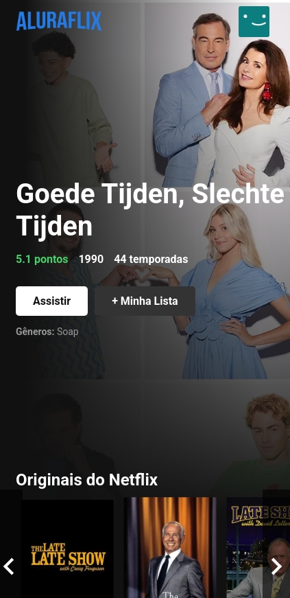

# AluraFlix 🎬

Clone da Netflix desenvolvido em **React** como projeto final do Bootcamp **Oracle Next Education** em parceria com a **Alura**.

## 📄 Descrição

O **AluraFlix** é um projeto que simula a interface e funcionalidades básicas da Netflix, utilizando tecnologias modernas de desenvolvimento front-end.

🎯 **Objetivo do projeto**

Este projeto foi desenvolvido para colocar em prática conceitos fundamentais de desenvolvimento Front-End com React, consumo de APIs REST, além de boas práticas de responsividade e estilização.

---

## 🚀 Tecnologias Utilizadas

- **ReactJS**
- **JavaScript (ES6+)**
- **HTML5**
- **CSS3**
- **The Movie Database API (TMDb)**

---

## 💻 Funcionalidades

- Exibição de lista de filmes e séries com dados reais consumidos da **API do The Movie Database (TMDb)**.
- Interface responsiva inspirada na Netflix.
- Componentização com React.
- Consumo de APIs com `fetch` ou `axios`.
- Rotas com React Router (se aplicável).

---

## ⚙️ Configuração da API Key

Para rodar o projeto, é necessário gerar sua própria API Key no site do [The Movie Database (TMDb)](https://www.themoviedb.org/documentation/api):

1. Crie uma conta no TMDb.
2. Acesse sua área de desenvolvedor e gere uma API Key.
3. Substitua a chave no arquivo de configuração (`src/config.js`) pelo seu próprio valor.

---

## 🖼️ Imagem da Aplicação


Aqui eu deixei um screenshot da aplicação (na visão para celulares) para mostrar a interface.
Exemplo:




---

## 🚀 Instalação e Execução

Para rodar o projeto localmente, execute os comandos abaixo no terminal:

```bash
git clone https://github.com/Gabriel-Aranda1406/Netflix_Clone_ReactJS.git && \

cd Netflix_Clone_ReactJS && \

npm install && \

npm start
